# NYC Taxi Big Data Analytics

This project analyzes **March 2026 NYC Yellow Taxi Trip Records** using a big data analytics workflow. The goal is to transform raw taxi trip records into useful insights about taxi demand, revenue, trip behavior, passenger behavior, payment methods, and fare prediction.

The project uses:

* **Polars** for initial data preparation and cleaning
* **PySpark** for transformation and aggregation
* **Spark ML** for fare prediction
* **Power BI** for dashboard visualization

---

## Project Objective

The main objective of this project is to apply data-driven decision-making on NYC Yellow Taxi trip data.

The project answers questions such as:

* Which days had the highest number of taxi trips?
* Which locations had the highest taxi activity?
* Which pickup locations generated the highest revenue?
* How does trip distance affect fare amount?
* Which hours generated the highest total revenue?
* What payment method was most commonly used?
* What is the average trip distance and average fare amount?
* Can fare amount be predicted using trip characteristics?

---

## Dataset

The dataset files are not included in this repository because they are large.

This project uses **March 2026 Yellow Taxi Trip Records** from the **New York City Taxi & Limousine Commission (NYC TLC)**.

Dataset source:

https://www.nyc.gov/site/tlc/about/tlc-trip-record-data.page

The local workflow used three Parquet files:

```text
data/
├── yellow_tripdata_2026-03.parquet
├── cleaned_taxi_data.parquet
└── final_taxi_data.parquet
```

For full dataset setup details, see:

```text
data/README.md
```

---

## Repository Structure

```text
nyc-taxi-big-data-analytics/
│
├── README.md
├── requirements.txt
├── .gitignore
├── nyc_taxi_big_data_analytics.ipynb
│
├── data/
│   └── README.md
│
└── visualizations/
    ├── dashboard_1.png
    ├── dashboard_2.png
    ├── trips_by_day.png
    ├── trips_by_location.png
    ├── earnings_by_pu_location.png
    ├── tip_by_hour.png
    ├── trips_by_passenger_count.png
    ├── trip_dist_avg.png
    ├── trip_amount_avg.png
    ├── trips_by_payment_method.png
    ├── amount_by_distance.png
    └── sum_earnings_by_hour.png
```

---

## File Description

### `nyc_taxi_big_data_analytics.ipynb`

This is the main notebook of the project.

It includes:

* Loading the Yellow Taxi Parquet dataset
* Selecting useful columns
* Cleaning missing and invalid records
* Creating new time, duration, revenue, and payment features
* Applying PySpark transformations
* Aggregating demand, revenue, payment, and location patterns
* Building a Spark ML pipeline
* Training a Linear Regression model to predict `fare_amount`
* Exporting processed data for Power BI dashboards

---

### `data/README.md`

This file explains:

* The original dataset source
* The local data files used in the workflow
* Why the dataset is not uploaded to GitHub
* How to reproduce the dataset locally

---

### `visualizations/`

This folder contains exported Power BI dashboard screenshots.

The original dataset and Power BI file are large, so the dashboard screenshots are included to make the insights visible directly on GitHub.

---

### `requirements.txt`

This file lists the Python libraries needed to run the notebook.

---

### `.gitignore`

This file prevents large files such as `.parquet`, `.csv`, `.zip`, and `.pbix` files from being uploaded accidentally.

---

# Workflow

## 1. Feature Selection

The first step was selecting only the columns relevant to the project objectives.

The project focused on taxi demand, trip behavior, revenue, fare patterns, passenger behavior, and payment methods.

Selected columns included:

* `tpep_pickup_datetime`
* `tpep_dropoff_datetime`
* `PULocationID`
* `DOLocationID`
* `passenger_count`
* `trip_distance`
* `fare_amount`
* `tip_amount`
* `total_amount`
* `payment_type`

Other columns such as `VendorID`, `RatecodeID`, `store_and_fwd_flag`, `extra`, `mta_tax`, `improvement_surcharge`, `congestion_surcharge`, and `airport_fee` were not used because they were less directly related to the main project goals.

This helped reduce complexity and kept the analysis focused on meaningful business questions.

---

## 2. Data Cleaning

After selecting the relevant columns, the dataset was cleaned to remove missing and invalid records.

The cleaning process included:

* Removing null values from important columns.
* Keeping `tip_amount` because it is normal for some trips to have no tip.
* Removing trips with `trip_distance <= 0`.
* Removing trips with `fare_amount <= 0`.
* Removing trips with `total_amount <= 0`.
* Keeping only realistic passenger counts from 1 to 6.
* Removing invalid `PULocationID` and `DOLocationID` values.
* Filtering extreme trip distance values.

This step was important because invalid records could produce misleading results in demand analysis, revenue analysis, and fare prediction.

---

## 3. PySpark Transformation

After the initial cleaning, PySpark was used to transform the dataset and create useful new features.

Created features included:

* `pickup_hour`: extracted from pickup datetime.
* `pickup_day`: extracted from pickup datetime.
* `pickup_date`: extracted from pickup datetime.
* `trip_duration_minutes`: calculated from pickup and drop-off timestamps.
* `revenue_per_mile`: calculated as total amount divided by trip distance.
* `payment_type_label`: readable payment method labels.

Additional filtering was applied after transformation:

* Removed trips with zero or negative duration.
* Removed trips with unrealistic long duration.
* Kept only records with valid revenue per mile.
* Kept pickup hours between 0 and 23.

---

## 4. Payment Type Transformation

The original `payment_type` column contained numeric codes.

PySpark was used to create a new readable column called:

```text
payment_type_label
```

The labels included:

* Credit card
* Cash
* No charge
* Dispute
* Other

This made the payment method analysis easier to understand in Power BI.

---

## 5. PySpark Aggregation

PySpark aggregation was used to summarize the trip-level dataset into business-friendly tables.

Aggregation was performed by:

* Pickup hour
* Pickup location
* Drop-off location
* Payment type
* Passenger count
* Pickup day
* Trip distance

These aggregations helped answer business questions about:

* Peak demand hours
* High-activity locations
* Top revenue pickup locations
* Passenger count behavior
* Payment method distribution
* Average tip behavior by hour
* Revenue patterns across the day

---

## 6. Spark ML Pipeline

After cleaning, transformation, and aggregation, a Spark ML pipeline was built for predictive modeling.

The model predicted:

```text
fare_amount
```

The features used for prediction were:

* `passenger_count`
* `trip_distance`
* `trip_duration_minutes`
* `revenue_per_mile`
* `pickup_hour`

The pipeline included:

1. Train-test split
2. `VectorAssembler`
3. `StandardScaler`
4. Linear Regression model
5. Model evaluation

The dataset was split into:

* 80% training data
* 20% testing data

`VectorAssembler` was used to combine the selected numerical columns into one feature vector. `StandardScaler` was then used to standardize the feature values so that features with different numeric ranges could be handled more fairly by the model.

---

# Model Evaluation

A Spark ML Linear Regression model was trained to predict taxi fare amount.

## Results

| Metric |   Value |
| ------ | ------: |
| MSE    | 45.9255 |
| RMSE   |  6.7768 |
| MAE    |  2.8342 |
| R²     |  0.8599 |

## Interpretation

The model achieved an R² value of `0.8599`, meaning it explained approximately **85.99%** of the variation in fare amount.

The MAE was `2.8342`, meaning the model prediction was off by about **$2.83** on average.

The RMSE was `6.7768`, which shows the average prediction error when larger errors are penalized more strongly.

Overall, the model performed well and showed that trip features such as distance, duration, revenue per mile, pickup hour, and passenger count are useful for estimating taxi fare amount.

---

# Power BI Dashboard

Power BI was used to create dashboards that communicate the main findings visually.

Because the dataset and Power BI file are large, this repository includes dashboard screenshots instead of the full `.pbix` file.

---

## Dashboard Overview 1

This dashboard summarizes passenger behavior, payment methods, average trip distance, fare-distance relationship, and hourly revenue.

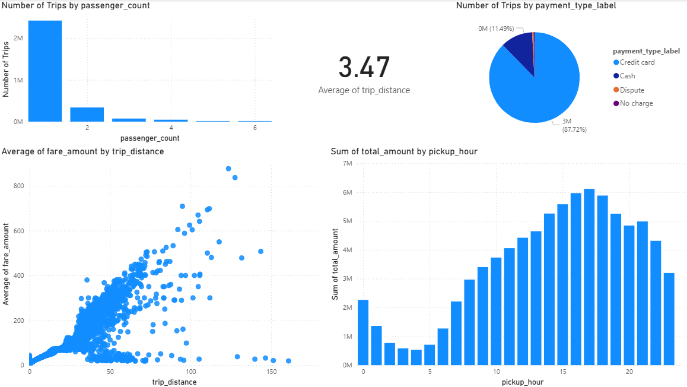

Key insights:

* Most trips were made by one passenger.
* Credit card was the dominant payment method.
* Average trip distance was approximately `3.47` miles.
* Average fare amount was approximately `19.60`.
* Fare amount generally increased as trip distance increased.
* Total revenue was higher during afternoon and evening hours.

---

## Dashboard Overview 2

This dashboard focuses on daily demand, location activity, pickup-location revenue, average fare amount, and tipping behavior by hour.

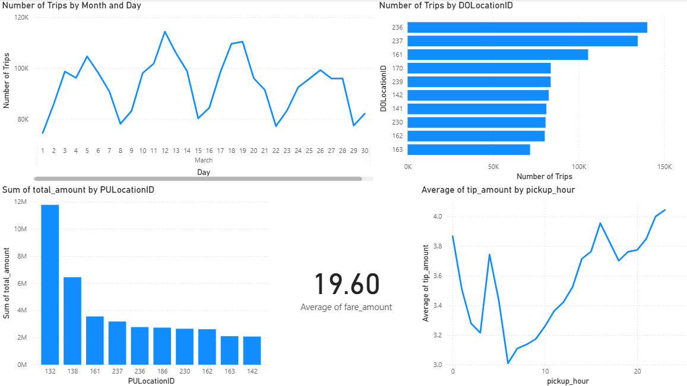

Key insights:

* Taxi demand fluctuated across the days of March.
* Some locations had much higher trip activity than others.
* Some pickup locations generated significantly higher revenue.
* Average tips were lower during some early hours and higher later in the day.
* Average fare amount was around `19.60`.

---

# Detailed Visualizations

## Number of Trips by Day

This line chart shows taxi demand across the days of March 2026.

Demand was not constant across the month. Some days had noticeably higher numbers of trips, while other days had lower activity.

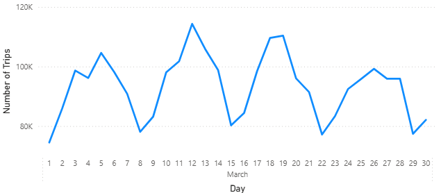

---

## Number of Trips by Location

This bar chart shows the highest-activity locations based on trip count.

A small number of locations had much higher trip activity, meaning taxi demand was concentrated in specific zones.

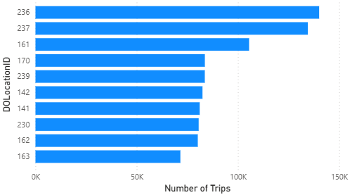

---

## Total Earnings by Pickup Location

This chart shows total revenue by pickup location.

Some pickup locations generated much higher total revenue than others, which makes them important for taxi allocation and operational planning.

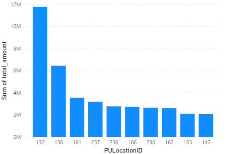

---

## Average Tip Amount by Pickup Hour

This line chart shows how average tip amount changed by pickup hour.

Tips were generally lower during some early hours and increased later in the day.

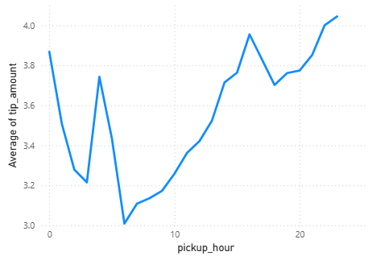

---

## Number of Trips by Passenger Count

This chart shows that most taxi trips were made by one passenger.

This indicates that solo trips dominated the dataset.

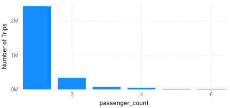

---

## Average Trip Distance

This card shows that the average trip distance was approximately:

```text
3.47 miles
```

This gives a quick overview of the typical taxi trip length in the cleaned dataset.

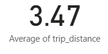

---

## Average Fare Amount

This card shows that the average fare amount was approximately:

```text
19.60
```

This provides a simple summary of the typical fare level in the cleaned taxi dataset.

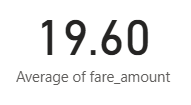

---

## Number of Trips by Payment Method

This pie chart shows the distribution of trips by payment method.

Credit card was the dominant payment method, representing the majority of taxi transactions.

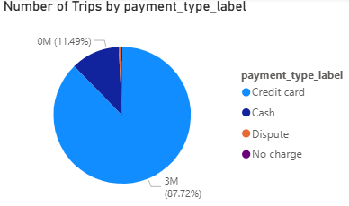

---

## Fare Amount by Trip Distance

This scatter plot shows the relationship between trip distance and fare amount.

In general, fare amount increased as trip distance increased. However, some outliers appeared, such as long trips with low fare values or short trips with high fare values.

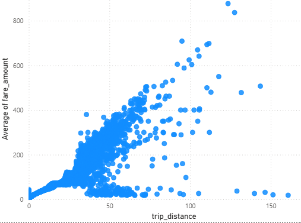

---

## Total Earnings by Pickup Hour

This chart shows total revenue by pickup hour.

Revenue was lower in early morning hours and increased later in the day, especially during afternoon and evening hours.

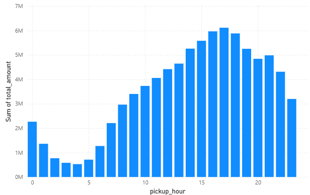

---

# Business Insights

The analysis produced several useful insights:

* Taxi demand was not evenly distributed across days.
* Taxi demand and revenue varied strongly by hour.
* Afternoon and evening hours showed higher revenue.
* Some pickup and drop-off locations were much more active than others.
* Some pickup locations generated much higher total revenue.
* Most trips were made by one passenger.
* Credit card was the most common payment method.
* Average trip distance was around `3.47` miles.
* Average fare amount was around `19.60`.
* Trip distance had a clear positive relationship with fare amount.
* Trip characteristics were useful for predicting fare amount.

---

# Recommendations

Based on the analysis, the following recommendations can support taxi operation planning:

1. **Increase taxi availability during high-demand hours.**
   More taxis should be allocated during afternoon and evening periods because these hours showed higher demand and revenue.

2. **Focus on high-activity locations.**
   Taxi operators should prioritize locations with high trip volume and high revenue.

3. **Use fare prediction to support planning.**
   The Spark ML model can help estimate fare amount based on trip features.

4. **Monitor unusual fare-distance records.**
   Outliers in the fare-distance relationship should be reviewed because they may indicate special cases, extra charges, or data quality issues.

5. **Maintain strong credit card payment support.**
   Since credit card payments were dominant, payment systems should remain reliable.

6. **Use dashboards for decision-making.**
   Power BI dashboards help stakeholders understand demand, revenue, passenger behavior, payment methods, and fare patterns without reading code.

---

# Limitations

Although the project produced useful results, it has several limitations:

* The dataset files are large and are not included in this repository.
* The analysis focuses only on March 2026.
* Seasonal patterns across other months were not analyzed.
* Location IDs were used instead of full taxi zone names.
* The dashboard screenshots are static and do not provide the full interactivity of Power BI.
* The Linear Regression model may not capture all complex non-linear fare patterns.
* External factors such as weather, traffic, events, road tolls, surcharges, and airport fees were not included in the final model.
* The Power BI file is not uploaded because it is large.

---

# Tools and Libraries

* Python
* Polars
* PySpark
* Spark ML
* Parquet
* Power BI
* Jupyter Notebook
* Pandas
* NumPy
* Matplotlib

---

# How to Run

1. Clone the repository:

```bash
git clone https://github.com/OsamaHasan1/nyc-taxi-big-data-analytics.git
```

2. Move into the project folder:

```bash
cd nyc-taxi-big-data-analytics
```

3. Install dependencies:

```bash
pip install -r requirements.txt
```

4. Download March 2026 Yellow Taxi Trip Records from NYC TLC:

```text
https://www.nyc.gov/site/tlc/about/tlc-trip-record-data.page
```

5. Place the data locally inside a `data/` folder.

6. Open and run:

```text
nyc_taxi_big_data_analytics.ipynb
```

7. Update the file paths inside the notebook if needed.

---

# Conclusion

This project demonstrates a complete big data analytics workflow using NYC Yellow Taxi trip records.

The workflow started with raw Parquet data, then applied data cleaning, transformation, aggregation, predictive modeling, and dashboard visualization.

The Spark ML Linear Regression model achieved strong predictive performance with an R² value of `0.8599` and an MAE of `2.8342`. The Power BI dashboards showed important patterns in taxi demand, revenue, passenger behavior, payment methods, trip distance, fare amount, and pickup-hour behavior.

Overall, this project shows how big data tools can transform large raw transportation datasets into strategic insights that support better operational decision-making.
